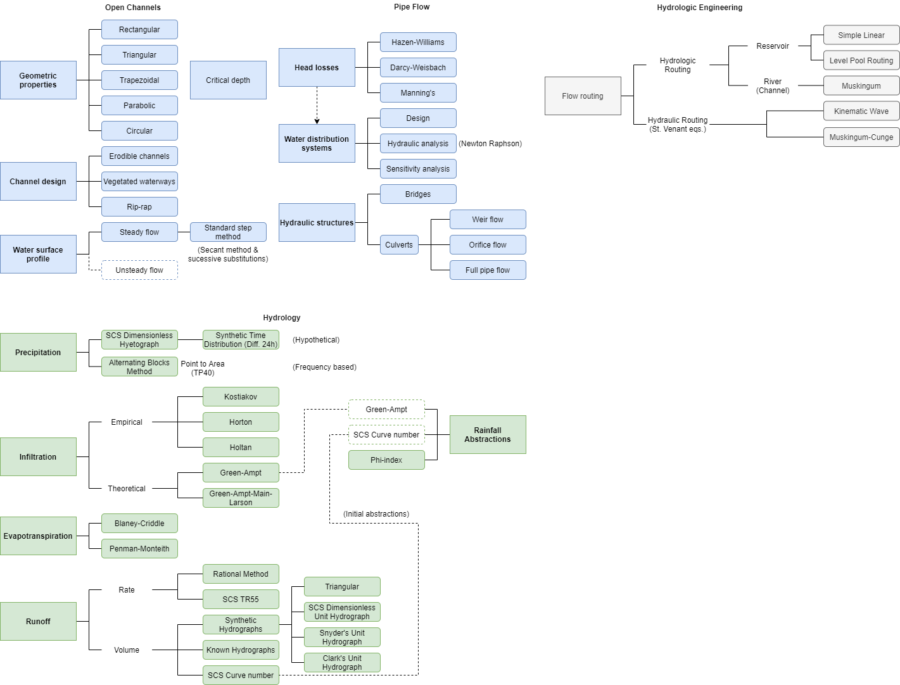
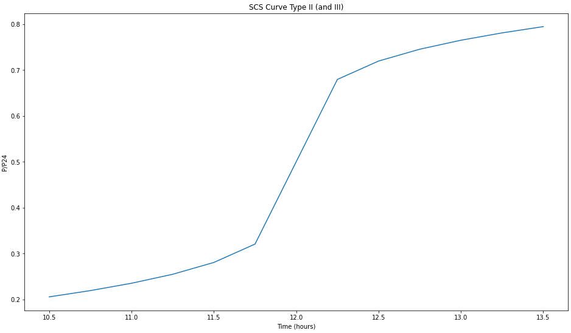
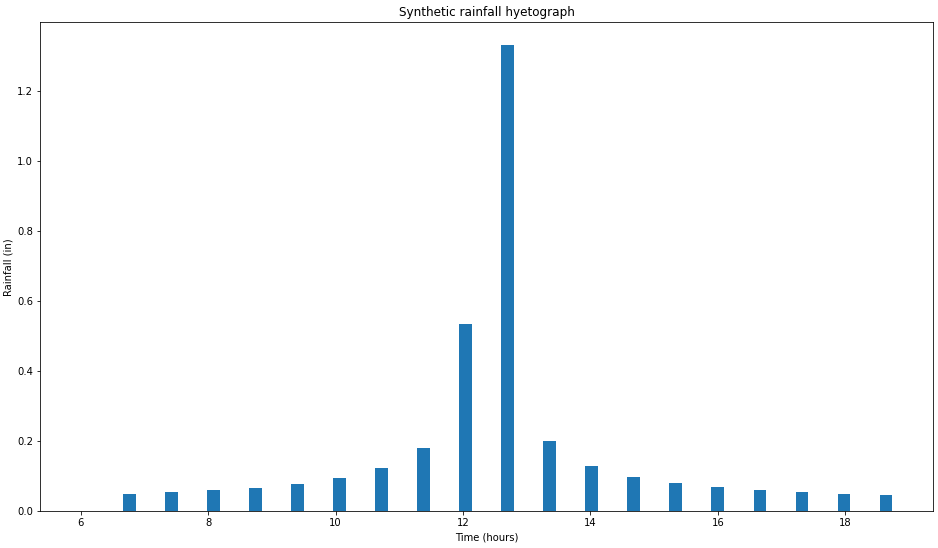

# hydrx
A Python 3 library for hydraulics and hydrology calculations.

# Motivation

In engineering is common to find computer systems for simulation of irrigation, hydraulic and hydrologic processes. This software is often offered in a specialized graphical user interface and limited by the options defined beforehand by the programmers. Programmers also determine the workflow, which typically includes data input, simulation runs, and analysis of results. However, modern interpreted programming languages such as MATLAB, R, Python or Julia, which are commonly used nowadays, allow an interactive style of simulation and analysis. This means simulations can be run step-by-step allowing changes in the simulation and model parameters, visualization and analysis of partial results, verification of intermediate calculations, and additional analysis or calculations not anticipated or provided by programmers.

# What is hydrx?

**hydrx** is an ongoing project, focused on the development of a Python 3 library, which provides user friendly, flexible, and computationally efficient tools for simulation in hydrology, hydraulics, and irrigation. The library provides modules for the processing and analysis of climate data, estimation of hydrologic variables, design of hydraulic infrastructure, and more. There is no preset order in the calculations so users can define them according to their interests and needs. An advantage of this approach is the possibility of performing sensitivity analysis, uncertainty analysis, and optimization. The library is free and open-source software so it can be readily adapted to other needs and integrated to work with other Python modules or software.

The library is composed by several modules which include classes (object) for the processing of climate data, and calculations of hydrologic, hydraulics, irrigation, and related topics.

In Figure 1 there is a schematic representation and organization of the processes that are foundations to be covered with the software library.

**IMPORTANT:** library is under development and only a few functions are implemented at the moment.

## Hydraulics

Hydraulic processes include the modeling and design of water flow in open channels and pressurized pipes.

- **Open channels**
  - Geometric properties of regular shapes (triangular, rectangular, trapezoidal) or natural streams
  - Erodible channels
  - Vegetated waterways
  - Riprap channels
  - Water surface profile with standard step method (secant method or successive substitutions)
  - Later, these calculations can be used for flow routing with Muskingum or Muskingum-Cunge methods.
- **Pipe flow**
  - Head losses with Hazen-Williams, Darcy-Weisbach, and Manning equations
  - Design or analysis of a single pipe (aims to water distribution system)
  - Modeling of hydraulic structures
  - Weir and orifice flows
  - Bridges or culverts

## Hydrology

- **Precipitation analysis methods** (rainfall distribution in time)
  - Alternating blocks method
  - Soil Conservation Service (SCS) dimensionless hyetograph
  
  
  - Synthetic time distribution different to a 24-hour duration can be derived
- **Losses**
  - Infiltration
    - Empirical methods: Kostiakov, Horton, and Holtan equations
    - Theoretical equations: Green-Ampt and Green-Ampt-Main-Larson (GAML)
  - **Evapotranspiration**
    - Blaney-Criddle
    - Penman-Monteith, both can be calculated using the common climate data obtained from the automatic weather stations.
  - **Runoff**
    - Rate methods: rational method
    - Volume methods: synthetic hydrographs (triangular, SCS dimensionless unit, Snyder’s, or Clark’s hydrographs) and known hydrographs, or the SCS curve number
  - **Initial abstractions** can be estimated as:
    - Infiltration methods
    - Fraction of the SCS curve number method
    - Initial/constants losses (φ-index method)

  Some of these methods can be linked to carry out reservoir routing calculations which can lead to design detention ponds or other storage structures.

# Using the code

To use the code you can download or clone the repository and see into the examples directory.
